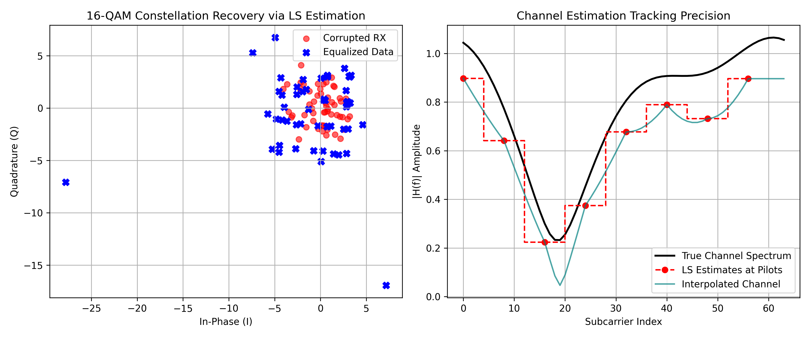

# End-to-End Orthogonal Frequency Division Multiplexing (OFDM) Transceiver

## 📌 Project Overview
This repository contains a complete, from-scratch physical-layer simulation of an **Orthogonal Frequency Division Multiplexing (OFDM)** wireless communication transceiver implemented in Python. The pipeline models the entire mathematical process of a modern digital communication link—converting digital data streams into multi-carrier waveforms, simulating complex channel degradations, and recovering the corrupted data at the receiver using signal processing algorithms.

## ⚡ Technical Architecture
The transceiver pipeline is broken down into modular structural blocks corresponding to real-world wireless hardware stages:
* **Constellation Mapping:** Modulates incoming random binary sequences into complex-valued **16-QAM** symbols.
* **Pilot Allocation & Frame Assembly:** Interleaves known pilot tones at uniform intervals across the subcarriers to enable downstream channel estimation.
* **IFFT/FFT Processing:** Performs Inverse Fast Fourier Transforms to modulate parallel orthogonal subcarriers into the time domain, and forward FFTs to decode them back to frequency domain bins at the receiver.
* **Cyclic Prefix (CP) Insertion:** Appends a guard interval to the beginning of each symbol block to eliminate Inter-Symbol Interference (ISI) caused by channel propagation delays.
* **Multipath Rayleigh Fading Channel:** Models frequency-selective channel distortion via multi-tap complex convolution alongside Additive White Gaussian Noise (AWGN) injection.
* **Least Squares (LS) Channel Estimation:** Derives channel frequency responses at the pilot subcarriers and applies linear interpolation to recover data matrices across the entire frequency spectrum.
* **Zero-Forcing Equalization:** Reverses channel amplitude and phase distortions to recover the original transmitted constellation.

## 📊 Performance Diagnostics & Verification
The underlying simulation verifies both tracking tracking precision and data recovery capabilities under active multi-path fading conditions:



* **Constellation Recovery:** The Zero-Forcing equalizer successfully counteracts severe channel dispersion, refocusing the heavily scattered raw received symbols back into distinct 16-QAM decision regions.
* **Estimation Precision:** The interpolated channel profile accurately tracks the true underlying channel spectrum curve across all 64 subcarriers.

## 🛠️ How to Replicate
1. Open the file `notebooks/ofdm_transceiver_pipeline.ipynb` in [Google Colab](https://colab.research.google.com/).
2. Run the notebook blocks sequentially to execute the full transceiver simulation.
3. The matplotlib script will automatically display individual constellation updates and export the diagnostic asset curves.

## 📂 Repository Structure
```text
├── notebooks/          # Colab simulation notebook implementations
├── assets/             # Diagnostic plots and signal visualizations
└── README.md           # Professional project documentation
